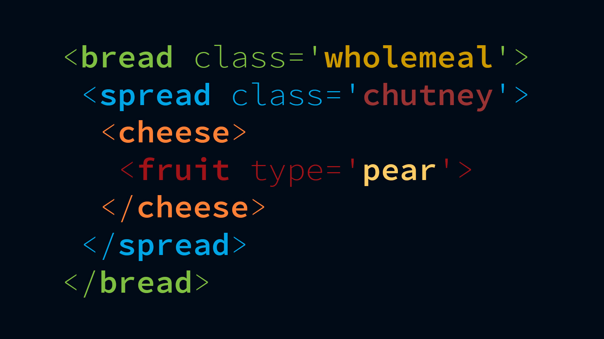
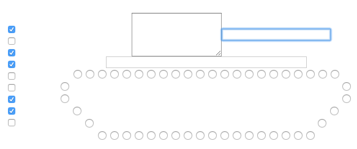

# Week 3

## Today, Monday 19th January 2015

1. HTML and CSS: which does what
* [HTML quiz](#quiz-time)
* [HTML in the kitchen](#html-in-the-kitchen) (exercise)
* Review bad websites
* [Project management basics](#getting-shit-done)


Your [homework](#homework): [blog](#blog)!


# The languages of the WWW

Different **languages**, separate [**concerns**](http://en.wikipedia.org/wiki/Separation_of_concerns#HTML.2C_CSS.2C_JavaScript).

Think of a group of people working together, eg to produce a car, a newspaper, a website, to provide education.. What are the different *roles* and *concerns* of these people?

## 1. **HTML** → content and structure  

##### 2. **CSS** → style and design 

##### 3. **JS** → behaviour and logic


_BBC homepage > Using the [Web Developer tool](http://chrispederick.com/work/web-developer/), disable CSS to show the separation of concerns in action._


# Quiz time!

1. `HTML` stands for How To Make Lunch [ true / false ]

2. `HTML` is a subset of `XML` [ true / false ]

3. The latest version of HTML is `HTML6` [ true / false ]

4. EVERY HTML **element** has an opening **tag** and a closing **tag** [ true / false ]
	
	```html
	<a href="http://example.com"> Click me! </a>   
	```
	
5. All **attributes** for an HTML elements MUST go both in the opening and closing tags  [ true / false ]
	
	```html
	<a href="http://example.com"> Click me! </a id="no-spaces-in-between"> 
	```
	
6. In an HTML document every `id` **attribute** MUST be unique [ true / false ]
	
	```html
    <p id="main-content">...</p>
    <div id="main-content">...</div>
    ```

7. An HTML **element** can have more than one `class` [ true / false ]
	
	```html
	<p class="highlight question">...</p>
	```
	    
8. In HTML all elements start on a new line and stack vertically [ true / false ] 

9. `<div>` is an **inline** HTML element [ true / false ]

10. `` is a **block** HTML element [ true / false ]

11. To create vertical space between HTML elements, you should use `<br>` [ true / false ]

12. A valid HTML document MUST have a `head` and a `body` elements wrapped in a `html` element [ true / false ]

<!--The <small> tag is used to add copyright information inside a <footer>  [ true / false ]

In HTML5, <header> is used to group  introductory or navigational aids, therefore a page can only have one <header> [ true / false ]

In HTML5 you can have an <article> within a <section> [ true / false ]-->


# HTML in the kitchen




### Your brief

Mark up the **recipe** for your favourite dish, using **appropriate HTML tags**.

* The **content** and **structure** of your recipe are up to you. 

* Decide what information to include, so that someone else can prepare the dish you chose.

* Make thoughtful decisions about what HTML elements to use to structure your recipe. 

	For instance, what HTML tags are appropriate for the ingredients list? And which ones are appropriate for the preparation method? Don't just use `<p>` everywhere.. <!--See this tutorial on sectioning-->

* Your HTML recipe must be a **valid HTML5** document.

	The XML sandwich in the image above **is not valid HTML**. Don't use `<bread>` or `<cheese>` in your recipe!

* Your HTML recipe should be ***naked***, aka no CSS and no decorative elements (eg `<br>` or `<hr>`)

	Try also not to use `` to convey information. Stick to **text only**.

* Push your HTML recipe to your fork of this project on GitHub (inside the `students > {yourName}` folder).

### Couple of tips

* To find which tags are appropriate for your recipe, you can use the [html5Doctor dictionary](http://html5doctor.com/element-index/).

* To create a valid HTML5 document without typing all the common stuff, you can use [HTML5 Boilerplate](https://html5boilerplate.com/).

* To write HTML on your computer, you can use [SublimeText](http://www.sublimetext.com/2) (my favourite, free-ish) or [Brackets](http://brackets.io/).


# Bad websites review

Spotting a bad website is quite easy. You'll know when you find one.

However, it's not so easy to pinpoint **why** it is bad.

Sometimes bad websites are **not so obviously bad**. Their badness emerges as you use them, and cracks start to appear in what may be a pleasing layout.

Let's analyse a few bad websites together, using [these principles](https://github.com/RavensbourneWebMedia/WEB14104/blob/master/sessions/week-02.md#what-makes-a-website-bad) (from last week) to work out **what makes them bad**. In pairs, cross-analyse your partner's chosen website. See how many principles you can tick off. Whoever has more principles wins! (proposing new principles is welcome)


# Getting shit done

Let's watch [The (martial) art of stress-free productivity](https://www.youtube.com/watch?v=CHxhjDPKfbY) by David Allen, the guru of [GTD (Getting Things Done)](http://gettingthingsdone.com).

Let's also play the [GTD buzzword bingo](http://www.bullshitbingo.net/cards/gtd/) while we watch the video.

### What is GTD?

> From [GTD For Hackers](http://gtdfh.branchable.com/quickie-overview/)

> GTD is a system for *managing your life*: what you want to achieve,
how you plan to achieve that, and how you deal with all the stuff life
throws at you. You decide goals, the system helps you reach them.

> A condensed summary of GTD:

> *   stuff enters your life, and you either deal with it immediately, or put it in one or more inboxes
> *   you empty your inboxes regularly from stuff
> *   stuff is dealt with by one of the following:

>     *   **do it at once** (if it's quick, or you have to, or really want to);
>     *   **defer** it for later;
>     *   **delegate** it to someone else;
>     *   **file** it somewhere (if you may need it later);
>     *   **discard** it (ignore it, throw it in a trash bin, whatever)

> *   keep several lists:

>     *   **next actions**: deferred stuff;
>     *   **projects**: anything that needs more than one next action to be
finished;
>     *   **waiting for**: delegated stuff;
>     *   **someday/maybe**: what you may want to do someday, but isn't an active concern right now

> *   at least once a week, process all inboxes, and review all lists
> *   have an archiving system for documents and such
> *   have a system for keeping handy files and other things relevant to current projects and next actions

### Tools

Apps that can help you treat your personal life like it's a software development project

* [Wunderlist](https://www.wunderlist.com/)
* [Trello](https://trello.com/)
* [Todoist](https://en.todoist.com)


# Homework

### Blog

Create a (prioritised) *todo list* of how you intend to improve the bad website. This will become your *action plan* and we'll check against it every week.

Push your action plan (either as MarkDown or HTML) to your fork of this project on GitHub (inside the `students > {yourName}` folder).



[Form Art by Alexei Shulgin](https://www.artsy.net/artwork/alexei-shulgin-form-art)