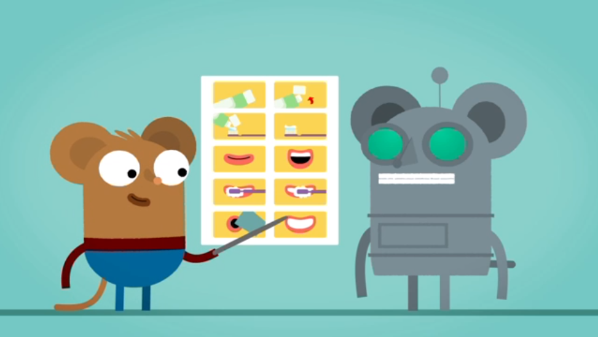
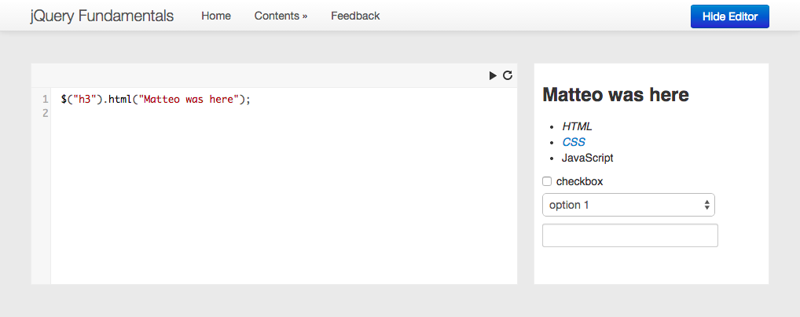

# Week 10

### Today, Friday 17th April 2015

1. [PoP (principles of programming)](#programming-vs-coding)
* Meet [JavaScript](#lets-code) and [jQuery](#meet-jquery)

Your [homework](#homework) and [blog](#blog)!

# Programming vs coding

Do *coding* and *programming* mean the same thing?

[](http://www.bbc.co.uk/guides/z3whpv4#zyfwjxs)

* Coding: writing code
* Programming: designing a list of instructions to get something done (aka **algorithm**) and then coding such instructions

[What's an algorithm?](http://www.bbc.co.uk/guides/z3whpv4#zyfwjxs)

* Computers can code.
* Computers can't program. People can.

### Programming languages

Last term we learned how to create the **visual elements** of a Web product (site, page, app etc) using **HTML** + **CSS**. 

<!--We could describe this process as **coding**.-->

To set things in motion, to have a truly interactive experience, we need another ingredient: **JavaScript**.

#### 1. **HTML** → content and structure  

#### 2. **CSS** → style and design 

#### 3. **JS** → behaviour and logic

HTML and CSS are coding languages.

JavaScript is a programming language (together with PHP, Python, Ruby, C, Java and many others).


### Natural vs programming languages 

* `the cat drinks milk` English 
* `de kat drinkt melk` Dutch
* `die Katze trinkt Milch` German 
* `il gatto beve latte` Italian 

Can you see a pattern here? A *subject* performing an *action* on an *object*. No matter which language, the structure is the same.

That structure is what we call **grammar**, the rules defining how you can put words together in order to communicate anything.

`drinks milk the cat` wouldn't work as a meaningful sentence, even though the components are the same.

1. `drinks`
* Who? `the cat`
* What? `milk`

If we know the meaning of each component...

... and we know the rules that define the relationships between such components (*grammar*)...

... then we can build the meaning of the whole sentence.

<!--  

	Inspiring talk from Ajit Narayan about abstraction, language, grammar, speech and a visual grammar engine

	http://avazapp.com/freespeech/

	http://www.ted.com/talks/ajit_narayanan_a_word_game_to_communicate_in_any_language/transcript?language=en

  -->

Imagine you read this sentence in a language you don't speak. You can still try and make sense of it, by comparing it to a language you know. This process of *trying to make sense* is very important in programming.

How about this language?

`cat.drink(milk)` JavaScript (written by an English-speaking human)


### Robot time!

Let's pretend I'm a **robot** and you have to **program me**.

[](https://thenounproject.com/term/driven/62030/)

* **Mission**: find an object in the room, pick it up

* I only understand these **commands**: 
 
	`walk(steps)`
	
	`turn(degrees)` 
 	
 	`grab(thing)`

* I can hear, but can only say `yes` or `no`

<!--People usually start by giving you very *specific instructions* (eg: walk 3 steps, turn 45 degrees, walk 2 steps..): **remote-controlling**

We can then make them their code more *abstract* and *flexible* with **logic** and **functions**.
	
(The idea is to engage people with an [easy task](http://pss.sagepub.com/content/early/2012/08/31/0956797612446024.abstract) before we challenge them with a demanding one)-->
	

### Principles of Programming

There are lots of programming languages, and they share the same core principles, and the same **building blocks**: 

1. **Variables** store data 
* **Functions** define reusable sets of instructions
* **Logic** is about making choices (if this then that)

What variables, functions and logic do you use in your everyday life (even if you don't call them so)?

* **Variables** weather (sunny, cloudy, warm, cold..), date, location.. 
* **Functions** get out of bed, check weather (on you phone, on TV..), check calendar
* **Logic** if sunny then wear sunglasses, if rainy then take umbrella

Think about the robot game: which variables, functions and logic did we use?


# Let's code

Meet the [**JavaScript Console**](http://webmasters.stackexchange.com/a/77337).


It's like having a chat with your browser.

```javascript
hello
	Uncaught ReferenceError: hello is not defined
"hello"
	"hello"
```

Difference between words with **speech marks** (the browser simply parrots them) and words without speech marks 

```javascript	
var salutation = "hello"
	undefined
salutation
	"hello"
salutation = "hej"
	"hej"
salutation
	"hej"
```

Using **variables** to get the browser to remember things.

```javascript	
alert("ciao")
	undefined
alert(salutation)
	undefined
prompt("How do you say hello in your language?")
	"ciao"
var userSalutation = prompt("How do you say hello?")
	undefined
userSalutation
	"hola"
```

The browser can perform certain actions (aka **functions**) natively, like humans can natively breath, eg: `alert` and `prompt` 

We can also teach the browser how to do stuff, by **defining our own functions**
	
```javascript	
cat
	Uncaught ReferenceError: cat is not defined
var cat = {}
	undefined
cat.name = "Bill"
	"Bill"
cat
	Object {name: "Bill"}
```

**Objects** are useful to keep things organised.

```javascript	
cat.meow = function(){ alert("MEOOOOOOW") }
	function (){ alert("MEOOOOOOW") }
cat.meow()
	undefined
cat.drink = function(beverage){ alert("I am drinking " + beverage) }
	function (beverage){ alert("I am drinking " + beverage) }
cat.drink("milk")
	undefined
cat.drink("tea")
	undefined
cat.drink("beer")
	undefined
```

We can add pretty much anything to objects, including functions.

Functions are useful to **make code reusable**. For instance, the action of *drinking* remains the same, no matter what you are drinking.


### Meet jQuery

> [jQuery](https://jquery.com/) is a fast, small, and feature-rich JavaScript library. It makes things like HTML document traversal and manipulation, event handling, animation, and Ajax much simpler with an easy-to-use API that works across a multitude of browsers. With a combination of versatility and extensibility, jQuery has changed the way that millions of people write JavaScript.

You may have heard of jQuery because of its *plugins* (image sliders, date pickers, colour pickers, form validators, image uploaders..) and maybe you've tried to mess around with those a bit.

jQuery uses CSS-like selectors, so for example if you want to manipulate a `h1` element in your page, you can do it like this

```js
jQuery("h1").hide();
``` 

which is the equivalent of telling the browser to `select all h1 elements in the page` (same as CSS) and `apply the hide function to them` 

### Making stuff happen on demand

This is what makes *programming* languages so much more powerful than coding languages like HTML and CSS. 

Programming has something to do with the *future*: you define instructions and *behaviour* that will happen in the future, *if* and *when* something specific happens.

For example, we want a certain element in the page to hide only when we click on a certain button. Using jQuery, we can do it like this

```js
// $ is a shortcut for jQuery
// jQuery("button") is the same as $("button")
// select the button, and make it run the function hideH1 when the "click" happens
$("button").on("click", hideH1);

// define the hideH1 function
function hideH1() {
	jQuery("h1").hide();
}
```

Learn more about [how jQuery works](http://learn.jquery.com/about-jquery/how-jquery-works).


# Let's program

### Brief

> Make an app that helps people **make lunch**. The app must take a human **input** (eg: search keywords), use **data from the Web**, and then present a human-readable **output** (eg: list of recipes)

1. Break down the problem 
* Define the solution (aka *algorithm*)
* Code the algorithm (aka the *program*)


# Resources

[Eloquent JavaScript](https://docs.google.com/document/d/1aa2-HtUglQrAps31s4LdTPVsiFb1BxhyjZolxeezzcI/preview?sle=true), linked here as a loooong Google document, is an excellent book on the principles of programming. It applies them to JavaScript. 

> **Programming, it turns out, is hard**. The fundamental rules are typically simple and clear. But programs built on top of these rules tend to become complex enough to introduce their own rules and complexity. **You’re building your own maze**, in a way, and you might just get lost in it.
 
> Analogies that try to compare programs to objects we are familiar with tend to fall short. A superficially fitting one is that of a machine—lots of separate parts tend to be involved, and to make the whole thing tick, we have to consider the ways in which these parts interconnect and contribute to the operation of the whole.

> A computer is a machine built to act as a host for these immaterial machines. **Computers themselves can do only stupidly straightforward things**. The reason they are so useful is that they do these things at an incredibly high speed. A program can ingeniously combine an enormous number of these simple actions in order to do very complicated things.


[jQuery Fundamentals](http://jqfundamentals.com) is an interactive guide to get comfortable working through common problems you'll be called upon to solve using jQuery.


<!--- [ ] [Learnable Programming](http://worrydream.com/LearnableProgramming) -->


# Homework

### Challenge

Go to jQuery Fundamentals and learn about [jQuery HTML manipulation](http://jqfundamentals.com/chapter/traversing-manipulating).

[](http://jqfundamentals.com/chapter/traversing-manipulating)

Using its *editor*, make these happen:

1. Change the content of `h3` (to whatever you like)
* Change the content of the `li` currently saying `CSS` (to whatever you like)
* Make the `select` dropdown disappear
* Tick the `checkbox`
* Type some text into the `input` text box, capture its `value` and then add it at the end of the `ul`

### Blog

Screenshot your code and its results (like in the image above) and then push it to your folder on GitHub.


<!--
[Link Codio to your GitHub repository](https://codio.com/docs/ide/editing/git/remotes/)

 Tools > Git > Remotes...
	* name: `origin`
	* URL: your GitHhub repo's URL
* open Codio's Terminal and type `git pull origin master` to pull your repo into Codio
* [Install Ungit](http://forum.codio.com/t/install-and-use-ungit-on-codio/885)
-->
