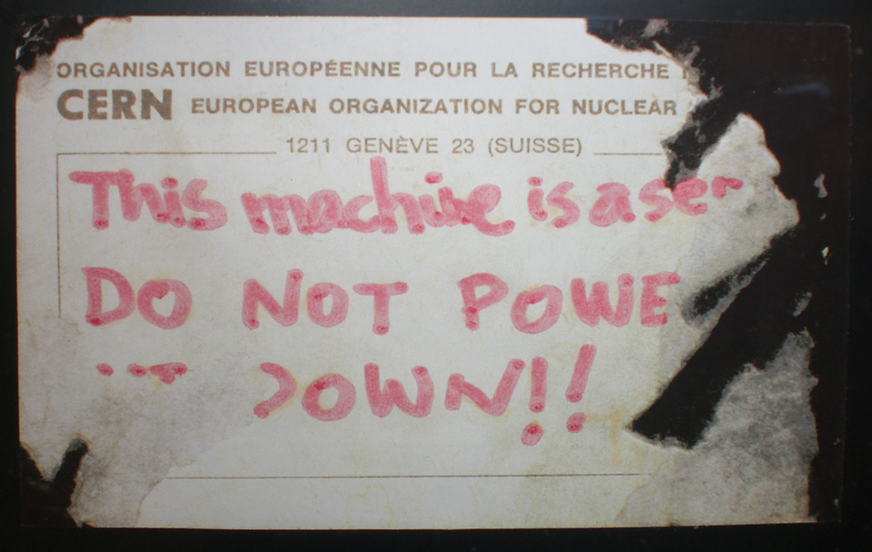

# Week 12

### Today, Friday 1st May 2015

1. [HTML+CSS wireframes review](#wireframes-review)
* [Debugging](#debugging)
* [Recipes app](#recipes-app)
* [Programming on the server](#programming-on-the-server)
* Meet WordPress

Your [homework](#assignment)!


<!-- Managing online content with WordPress -->


# Wireframes review

5 minutes each

* Is anything important missing from this page?
* Is there anything on this page that shouldn't be there?
* Can you get to all of the major sections of the site from here? Should you be able to?
* Do all of the labels make sense?

* Which framework / boilerplate are you using, and why?
* Let's see the **source code**..


# Debugging

Why *debugging*? So the [story goes](http://en.wikipedia.org/wiki/Debugging#Origin): one morning Grace Hopper found an actual bug stuck in one of the relays of a computer she was working on...


When programming, things don't always go as expected.

Imagine yourself as a *scientist*: you formulate a **hypothesis** about how the computer is going to interpret and execute your code. When you test that code, your hypothesis doesn't yield the results you're expecting.

For example, you're expecting a `function` to be triggered when someone clicks a `button`. When you click that button, nothing happens.. or even worst, the button click trigger works for you but not for your friend / colleague / client!

What to do?

#### 1. Find a way to reproduce the problem

What are the steps required to make the bug happen consistently? 
	
Is there any particular hardware / software configuration for the bug to surface? Eg: it only happens on iOS devices, or Internet Explorer 9
	
#### 2. Track down the origin of the problem

You may have to simplify your code, for instance creating a reduced version of your program with only a few lines from the original source code, where the bug still happens.
	
This removes complexity and prevents us from being side-tracked by unrelated issues.
	
#### 3. Study the problem

This is the crucial part. No matter which language you're programming in, it's essential to have a strategy for *seeing the state* of your program when it executes.
	
If you use JavaScript and debug your code in a Web browser, you can use the [Console](http://webmasters.stackexchange.com/a/77337) and [breakpoints](https://developer.chrome.com/devtools/docs/javascript-debugging) to see the state of your program. 
	
* If you have a **syntax error**, the Console will tell you where that error is (file name and line number), as well as a semi-useful indication of what the error may be
```js
Uncaught SyntaxError: Unexpected end of input       main.js:5
```	

* If you have a **data error**, the Console will tell you where that error is (file name and line number), as well as a semi-useful indication of what the error may be
```js
Uncaught ReferenceError: jQuery is not defined       main.js:25
```	

* If you have a **conceptual error** (nothing is technically wrong but things are not happening as expected) you can use `console.log(someVariable)` to see if your program is being fed the expected data, and/or using **breakpoints** to see if the program is hitting a certain point of execution.

#### 4. Ask Google

See if someone else had (and hopefully fixed) the same problem.

The more specific you are about your problem, the more relevant results you should find. Especially on places like [StackOverflow](http://stackoverflow.com)

#### 5. Fix, test and repeat	


### Debugging challenge

Go to [this pen on CodePen](http://codepen.io/baddeo/pen/YXPpwV?editors=001) and ***fork** it* (a fork is like a photocopy, for code).

1. Open the debug version of the forked pen
2. Right-click anywhere on that page, choose *Inspect Element*
3. Click [**Console**](http://webmasters.stackexchange.com/a/77337) from the panel that will pop up

There are 6 (+bonus) challenges for you to solve!


# Recipes app

Last week we started building a [recipes app](resources/recipe-app)

What's missing:

* style the interface (make it responsive)
* clear previous search results 
* tell people [something is happening]([visibility of system status](http://www.nngroup.com/articles/ten-usability-heuristics/)) after they hit the *Search* button
* anything else?


# Programming on the server

### What's a server?


Just a computer that is **always on**, **connected** to the Internet and ready to accept **HTTP requests** and serve documents (HTML, CSS, JS, images etc) in **response**.

[](http://en.wikipedia.org/wiki/CERN_httpd)



[](https://www.google.co.uk/search?q=google+server+farm)

### Can I run a WebServer on my computer?

Yes!

[WAMP](http://www.wampserver.com/en/#wampserver-64-bits-php-5-3) is for Windows, [MAMP](https://www.mamp.info/en) is for Mac (well, now for Win too), [XAMPP](https://www.apachefriends.org) is for both (+ Linux)

[Vagrant](https://www.vagrantup.com/downloads.html) + [VirtualBox](https://www.virtualbox.org/wiki/Downloads)

<!-- [vccw](http://vccw.cc) -->

<!--[ServerPress](https://serverpress.com)-->


<!-- http://wptavern.com/13-vagrant-resources-for-wordpress-development 

https://github.com/chad-thompson/vagrantpress/tree/master/puppet -->

[Bitnami](https://bitnami.com/stack/wordpress) (easier but heavier)


### Meet PHP

When we develop for the browser (*front-end*), there is only one programming language available to us: Javascript. 
On the *back-end* or **server-side** we can choose whichever language we want.

[PHP](http://php.net) is a popular programming language for Web servers, because it underpins websites like WordPress and Facebook, but also because it has been around a long time. 


# WordPress

- [ ] TODO

<!--http://www.smashingmagazine.com/2011/09/28/developing-wordpress-locally-with-mamp/

http://polevaultweb.com/2014/03/5-ways-synchronise-wordpress-uploads-across-environments/ particularly `#4` seems like a smart solution

http://ftploy.com/ tracks a Git repo and deploys automatically

http://wp-cli.org/ is a command line interface for WordPress

https://plausiblethought.net/wordpress-git-workflow/-->


# Assignment

- [ ] TODO


<!-- - [ ] Using [Codio WP starter pack?](https://codio.com/home/starter_packs/67c86f01-41bb-44d3-97be-6dedc40fc0bd) -->


<!-- 

Programming  quiz 

https://www.khanacademy.org/computing/computer-programming/html-css-js/html-css-js-intro/e/quiz--javascript-recap

-->

