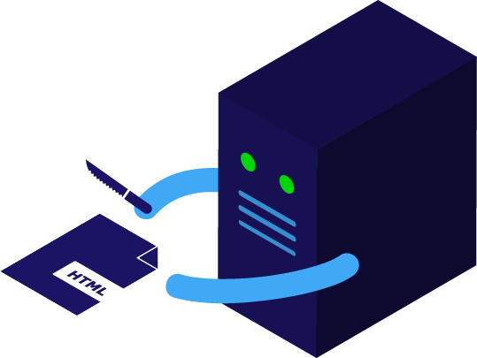
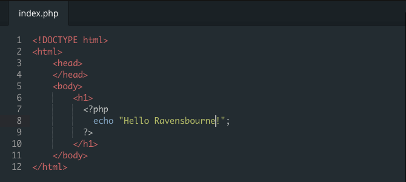

# Week 13

### Today, Friday 8th May 2015

1. [Debugging debate](#debugging-debate)
* [Programming on the server](#programming-on-the-server)
* [Meet PHP](#meet-php)

<!--* Meet WordPress-->

Your [homework](#assignment)!


# Debugging debate

Thinking about the [debugging challenge](week-12.md#debugging-challenge) from last week:

* How did you solve each challenge?
* What techniques did you use?
* What did you *search for*?
* What obstacles did you find?
* What did you learn?


# Programming on the server

Back-end 								| 	Front-end
---------------------------	| ---------
Server-side 							| 	Client-side
Server 									| 	Browser
PHP Ruby Python NodeJS etc. 	| 	JavaScript


### What's a server?



Just a computer that is **always on**, **connected** to the Internet and ready to accept **HTTP requests** and serve documents (HTML, CSS, JS, images etc) in **response**.

[](http://en.wikipedia.org/wiki/CERN_httpd)


[](https://www.google.co.uk/search?q=google+server+farm)

### Why do we need a server?


1. **Storage**, ie *hosting* stuff: websites, apps, media files...
* **Power**: a server computer can be a lot more powerful than the typical user computer, for example a mobile device
* **Dynamic content**: connect with a **database** to create pages on demand
* **Security**: you don't want private data (eg passwords) accessibly via *View Page Source* but locked away securely

### Can I run a Web server on my computer?

Yes!

That's what **local development** refers to. It's the process of building websites or apps from the comfort of a *virtual server*, and not needing to be connected to the Internet in order to run the *back-end* of your websites/apps.


* [WAMP](http://www.wampserver.com/en/#wampserver-64-bits-php-5-3) is for Windows
* [MAMP](https://www.mamp.info/en) is for Mac (well, now for Win too)
* [XAMP](https://www.apachefriends.org) is for both (+ Linux)

#### Q: what do you think *AMP stand for?

[Vagrant](https://www.vagrantup.com/downloads.html) + [VirtualBox](https://www.virtualbox.org/wiki/Downloads) is also cool.

<!-- 
[vccw](http://vccw.cc) 
[ServerPress](https://serverpress.com)
http://wptavern.com/13-vagrant-resources-for-wordpress-development 
https://github.com/chad-thompson/vagrantpress/tree/master/puppet -->

<!--[Bitnami](https://bitnami.com/stack/wordpress) (easier but heavier)-->

### Your turn

1. Download and install one of the Web server applications above.
* Once it's done, locate the [*root folder*](https://www.google.co.uk/search?q=root+folder) from which your Web server files are served.
* Inside the root folder, create a new folder and name it whatever you please.
* Inside the new folder, create a new HTML document and name it **`index.html`**. Put some content into it (anything you like, for instance `<p>Matteo lives here</p>`)
* Open a Web browser and point it to your *root folder*

	`http://localhost` (XAMPP) or `http://localhost:8888` (MAMP)
* Navigate to your new folder, eg `http://localhost/matteo`
* What do you see?

> [URLs](http://en.wikipedia.org/wiki/Uniform_resource_locator) are just **paths to files** and folders on a server (either on your `localhost` or on some `remote server`).

# Meet PHP

When we develop for the browser (*front-end*), there is only one programming language available to us: JavaScript. 
On the *back-end* or **server-side** we can choose whichever language we want.

[PHP](http://php.net) is a popular programming language for Web servers, because it underpins the likes of [WordPress](https://wordpress.org) and Facebook, but also because it has been around a long time. 

You can use PHP to make dynamic websites and web applications.

[](http://www.codecademy.com/en/tracks/php)

You can learn the basics of PHP on this [Codecademy course](http://www.codecademy.com/en/tracks/php). 

<!--Let's go through the first lesson together.-->

More resources to learn PHP:

* [PHP The Right Way](http://www.phptherightway.com)
* [Learn X in Y minutes](http://learnxinyminutes.com/docs/php)
* [learnPHP.org](http://learn-php.org)

### Debugging PHP

No matter which language you're programming in, it's essential to have a strategy for *seeing the state* of your program when it executes, so that you can find bugs and squash them (metaphorically).

As we'll see, debugging code that executes on a server is not as straightforward as debugging JS that runs in your browser. But fear not, there are ways to do it.

[](http://en.wikipedia.org/wiki/Autopsy)

It's a bit like **code [autopsy](http://en.wikipedia.org/wiki/Autopsy)**..

1. Somewhere in your **local Web server root folder** (see [above](#your-turn)), create a new file and call it **`index.php`**
2.  In your new PHP file, write something like 

	```html
	<!DOCTYPE html>
	<html>
	  	<head>
	  		<title>Hello PHP</title>
		</head>
		<body>
        <h1><?php print('Hello'); ?></h1>
        <h2><?php $name = "Matteo"; print($name); ?></h2>
		</body>
	</html>
	```
3. Save and navigate to that file in your browser.
4. What do you see?	
5. At the beginning of your `index.php` insert the following lines (make sure there are no spaces at the beginning of the file)

	```php
	<?php
		// a handy function to "console.log" PHP data
		function consoleLog($data) {
			if(is_array($data) || is_object($data)) {
				echo("<script>console.log(".json_encode($data).");</script>");
			} else {
				echo("<script>console.log(".$data.");</script>");
			}
		}	
	?>
	```	
5. Save and navigate to that file in your browser. If you're on Brackets, don't use the LivePreview button - instead, just open your folder in a normal Chrome tab, eg `http://localhost/hello-php`.
6. Open the Console and refresh the page. What do you see?


<!--1. Install [Chrome Logger](https://craig.is/writing/chrome-logger) (on Chrome, obviously).-->


<!--* Download [ChromePHP](https://github.com/ccampbell/chromephp) and copy `ChromePhp.php` into the same folder as your `index.php`-->

<!--* Make sure you click the extension icon to enable logging for the current tab's domain. 

	-->
	

<!-- 
What about these? 
https://github.com/barbushin/php-console 
http://raveren.github.io/kint/
-->

### Dynamic bento boxes!

PHP is (mostly) used to generate *dynamic* Web pages.

For example, Facebook doesn't host an HTML page for each user, each post, each photo etc.

Instead, they store your data in a database and when you request a certain page/post/photo, they use PHP to plonk data into a page/post/photo **template** and then serve you the *generated* HTML.

The template is the same, what changes is the data.


```php
<?php 
$myself = [
    "name" => "Matteo",
    "year" => 1983
];

function getAge($yearOfBirth) {
    $thisYear = date('Y');
    $age = $thisYear - $yearOfBirth;
    return $age;
}
?>
```	

```html
<h1>
    Hello <?php echo $myself["name"]; ?>
</h1>
<p>
    <?php 
        $age = getAge($myself["year"]);
        consoleLog($age);
        if ($age > 18) {
            echo("You can come in");
        } else {
            echo("Too young, go back home");
        }
    ?>
</p>
```

- [ ] Make a *Fakebook* feed..

<!--[PHP online playground](http://www.tehplayground.com), and [another](https://repl.it) -->


# Assignment

`Install WordPress locally`!

Google how to do it and then blog about how you went about installing WordPress on your local Web server.