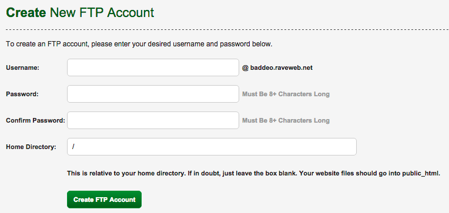
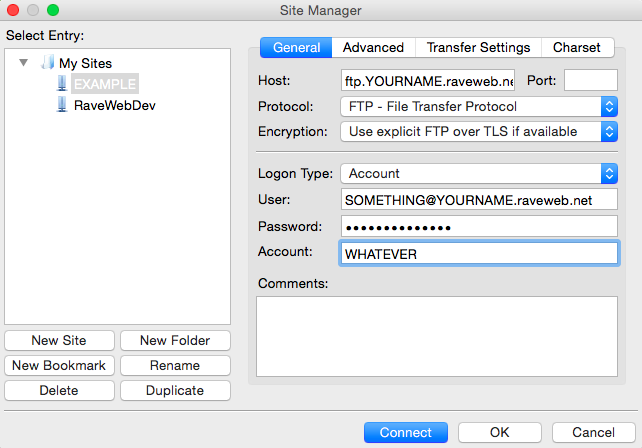
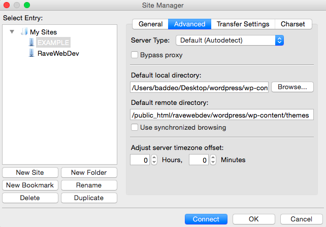
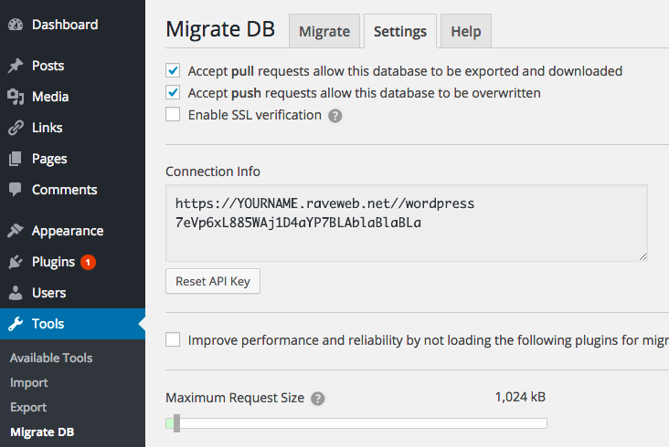
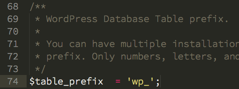

# Week 16

### Today, Friday 29th May 2015

* [How to put a website on the actual Web](#how-to-put-a-website-on-the-actual-web)
* [Reality check](#reality-check)

<!--
* Wordpress clinic: working in pairs
* Tutorials?
-->

<!--Your [homework](#homework) and blog!-->

<!--- [ ] LearnPress options-->

# How to put a website on the actual Web

So far you've been working *locally*. 

This is great for development, but at some point you want to **put your website on the actual Web**, so that everyone else can use it.

This process is called **deployment**, or **migration**.

If you google `how to migrate WP site` you'll find loads of tutorials explain you how to do it. If you google `how to migrate WP site to GoDaddy` for example you'll find specific instructions for that web-hosting provider.

Your challenge for today is to *deploy* your local WP to your **`raveweb.net`** space. 

### Ingredients

* An [FTP](http://en.wikipedia.org/wiki/File_Transfer_Protocol) app, such as [FileZilla](https://filezilla-project.org/download.php). 

	This will let you **transfer files** between your computer and the remote server.. similar to how you copy files between two folders on your computer, just one folder is on a server somewhere else on this planet.
	
	<!-- If you use Brackets you can try [this extension](http://equals182.github.io/eqFTP/) at your own risk. -->

* FTP details for the **remote server** where your website will be hosted
	* **host** something like `ftp.YOURNAME.raveweb.net`
	* **username** something like `SOMETHING@YOURNAME.raveweb.net`
	* **password** 
	
	On your [raveweb.net control panel](https://control.gridhost.co.uk) you can find (or create) your FTP details by going to `Cloud Platform` > `Manage Website` > `FTP Accounts`
	
	
	
	
	
	Set up **FileZilla** to connect to your remote server:
	
	
	
	Can you **connect**?

<!--* Access to a remote **database**
	* host
	* username
	* password
	* database name

	On your [raveweb.net control panel](https://control.gridhost.co.uk) you can find (or create) your database details by going to `Cloud Platform` > `Manage Website` > `MySQL Databases`.-->

### Method

1. **Install WP remotely** 

	On your [raveweb.net control panel](https://control.gridhost.co.uk) go to `Cloud Platform` > `Manage Website` > `Install Applications` and then choose WordPress (should be the first option).
	
	
	
	Click `Install`
	
	Make sure that the **path** is set to `/public_html/some_name_of_your_choice` (all lowercase, no spaces) 
	
	
	
	This is really important! 
	
	`/public_html/` is the folder from which all your reveweb.net is served to the public Web. So for example, if you install WP in `public_html/wordpress-test`	 then everyone will be able to access it at `http://YOURNAME.raveweb.net/wordpress-test`
	<!-- -->
2. **Take control of your new remote WP**	
	The application installer will give you a random username + password. Use them to log in to your remote WP dashboard.
	
	
	
	<!-- -->
3. **Upload your theme**  
  
  	Set up your FTP connection to default both locally and remotely to the `themes` folder
  	
  	
  	
  	Connect.
  	
  	
  	
  	Upload  your active theme to the remote `themes` folder.
  	
  	Once your theme is uploaded, go to your remote WP dashboard > `Appearance` > `Themes` and **activate** it.
  	
4. **Sync the database**	
	
	We want to take all the content from our local database and  upload it to the new remote database. There's a plugin for that.. 
	
	[Download *this* file](https://github.com/wp-sync-db/wp-sync-db/archive/1.5.zip). It's the [WP Sync DB plugin](https://github.com/wp-sync-db/wp-sync-db), which lets you *sync* WordPress databases with a single click.
	
	**On your remote WP** dashboard, go to `Plugins` > `Add New` > `Upload Plugin` and then upload *that* file.
	
	Install and activate the plugin. 
	
	**On your local WP** also install and activate the WP Sync DB plugin.
	
	**Back to your remote WP** go to `Tools` > `Migrate DB` > `Settings` and accept both *pull* (which means *download*) and *push* (which means *upload*) requests. 
	
	Then copy <kbd>cmd + c</kbd> the `Connection Info`.
	
	
	
	**In your local WP** go to `Tools` > `Migrate DB` > `Migrate` and click on `Push` (aka *upload*).
	
	Paste <kbd>cmd + v</kbd> the `Connection Info`.
	
	
	
	If you get the warning above: go to FileZilla, find `wp-config.php` and edit it.
	
	
	
	
	
	Save and upload.
	
	**Back to your remote WP** it'll tell you that you have been logged out. No problem, you can now log in with the same username + password of your local WP (because you just synced them).
	

### Takeaway

It's **good practice** to make experiments on your local WP: it's faster and if you break something it's only you who will see the disaster :)

Once you're happy with your experiments, you can upload them to the remote WP, so that everyone else can see how good you are:

1. FTP your active theme
	
	
* Sync the database (from your local WP, *push* to the remote WP)
* Possibly FTP your `wp-content/uploads` (if you have added any media to your local WP that needs uploading)

> I haven't yet found an easier / safer way to do this. If you do, [please let me know](https://twitter.com/@baddeo)!

<!-- 

Check out 

- http://timrourke.com/blog/tutorials/automated-wordpress-deployment-with-grunt/
- http://mattbanks.me/grunt-wordpress-development-deployments/

-->

<!--Then create a **new user** with `administrator` privileges, and give it username + email + password of your choice.
	
	This way you will be able to recover your pw via email in case you forgot it. And that happens very often :)-->

# Reality check 

[Project](../README.md#project) **deadline is the 12th of June** (in two weeks!)

When marking your projects, we'll use [these assessment criteria](../README.md#grades) and look for evidence of [these learning goals](../README.md#learning-goals).

### Getting things done

1. Sign up to [Trello](https://trello.com/) with your `@students.rave.ac.uk` email address
* Join the [trello.com/ravewebmedia](https://trello.com/ravewebmedia) organisation 
* Create a *board* for your project
* Write down a list of everything that needs doing
* Good luck :)

[Quick guide](https://trello.com/guide/board_basics.html) on  how to use Trello.

# Homework

- [ ] TODO